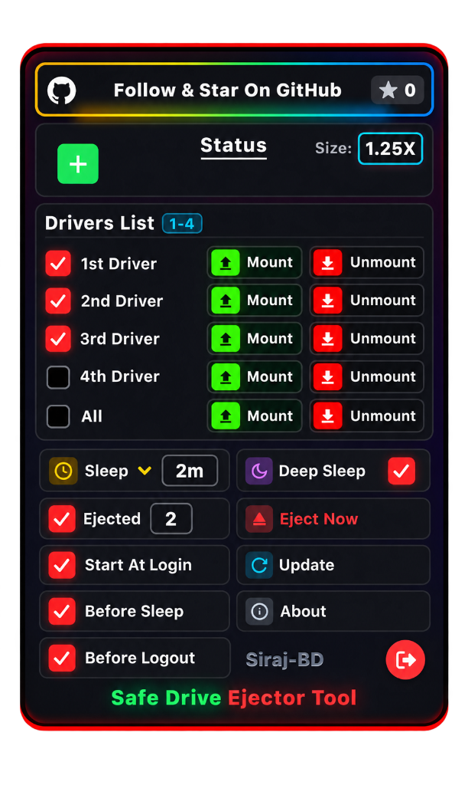

# Safe Drive Ejector Tool

<div align="center">

[](LICENSE)
[](#platform-support)
[](https://www.python.org/)
[](https://swift.org/)
[](https://github.com/siraj-bd/Safe-Drive-Ejector-Tool)

**A lightweight, premium cross-platform utility that automatically and safely ejects external disks before system sleep and re-mounts them upon wake.**

[Features](#key-features) • [Installation](#installation) • [Quick Start](#quick-start) • [UI Overview](#ui-overview) • [Configuration](#configuration) • [Contributing](#contributing)

<br />

<p align="center">
  
</p>

</div>

---

## Overview

Have you ever closed your MacBook lid or let your PC go to sleep, only to wake up to the dreaded **"Disk Not Ejected Properly"** warning?

**Safe Drive Ejector Tool** eliminates data corruption risks and annoying system warnings. It runs silently in the background or right from your macOS Menu Bar, automatically flushing disk caches and safely unmounting external SSDs, HDDs, USB drives, SD cards, and disk images before sleep—then seamlessly re-mounts them when you return!

---

## Key Features

- **Safe Ejection Before Sleep & Logout**:
  Cleanly flushes write buffers and unmounts all managed external volumes before the computer sleeps, screens turn off, or users log out.
- **Hardware Deep Sleep & Silence**:
  Puts external disks and USB bridges into true SATA slumber (LED off) with zero background wake polling or false touch triggers.
- **Native macOS Menu Bar App**:
  Built with Swift and modern glassmorphic web standards. Features a compact, floating, borderless card anchored to your top status bar with zero background bleed.
- **Natural BSD Name Sorting**:
  Follows macOS Disk Utility hardware node convention (`disk3s1` < `disk6s1` < `disk8s1` < `disk9s1`), keeping drive listings organized and predictable.
- **Dynamic Scale Selector**:
  Full responsive zoom support: **1X**, **1.25X**, **1.5X**, **2X**, **3X**, and **4X** scales.
- **Interactive Pager & Wheel Scrolling**:
  Navigate through connected drives using the 4-quadrant pager buttons (`1st`, `2nd`, `3rd`, `4th`) or scroll through your drive list using your mouse wheel / trackpad.
- **Per-Drive & Global Controls**:
  Mount or unmount individual drives with one click, or trigger a full **Eject Now** sweep.
- **Idle Sleep Timer Presets**:
  Optionally put inactive drives to sleep after customizable idle periods (`1m`, `2m`, `5m`, `10m`, `30m`, `1h`).
- **Zero Heavy Dependencies**:
  Core engine uses native OS system utilities (`diskutil` / `IOKit` on macOS; `mountvol` / `PowerShell` / `WMI` on Windows) with no required third-party Python packages.

---

## Platform Support

| Operating System | Menu Bar App | CLI / Background Daemon | Auto Sleep / Wake |
| :--- | :---: | :---: | :---: |
| **macOS 12+ (Monterey, Ventura, Sonoma, Sequoia)** | :white_check_mark: Native Swift | :white_check_mark: Python 3 | :white_check_mark: Full Support |
| **Windows 10 / 11** | :construction: System Tray | :white_check_mark: Python 3 | :white_check_mark: Full Support |

---

## Installation & First-Time Launch

### Option A: Pre-Built Standalone Release (Recommended)

Download the latest standalone package for your operating system from [GitHub Releases](https://github.com/siraj-bd/Safe-Drive-Ejector-Tool/releases):
- **macOS Universal (Apple Silicon & Intel)**: `SafeDriveEjector-1.0.1-macOS-Universal.dmg`
- **Windows x64**: `SafeDriveEjector-1.0.1-windows-x64.zip`

---

#### 🍎 macOS First-Launch Guide (Gatekeeper)

Safe Drive Ejector Tool is a 100% free, community-driven open-source utility. Because it is distributed directly on GitHub without a paid $99/year Apple Developer account, macOS Gatekeeper presents a standard security verification alert on your very first run:

> **"Safe Drive Ejector" Not Opened**  
> *Apple could not verify "Safe Drive Ejector" is free of malware that may harm your Mac or compromise your privacy.*

This is completely normal for community open-source software. You **do not** need to disable Gatekeeper globally or weaken system security.

**To Launch the Application (One-Time Setup):**

* **Method 1: Via System Settings (Recommended)**
  1. Open the downloaded `.dmg` and drag **Safe Drive Ejector.app** into your **Applications** folder.
  2. Double-click **Safe Drive Ejector.app**. When the warning dialog appears, click **Done**.
  3. Open **System Settings** (Apple Menu  > System Settings).
  4. Navigate to **Privacy & Security** and scroll down to the **Security** section.
  5. You will see: *"Safe Drive Ejector was blocked to protect your Mac."*
  6. Click **Open Anyway**, enter your Mac password or use Touch ID, and click **Open**.

* **Method 2: Via Terminal (One Command)**
  Clear the browser download quarantine attribute directly:
  ```bash
  xattr -d com.apple.quarantine "/Applications/Safe Drive Ejector.app"
  ```
  The app will now launch immediately from Applications, Spotlight, or your top status bar on every boot!

---

#### 🪟 Windows First-Launch Guide (SmartScreen)

1. Download and extract `SafeDriveEjector-1.0.1-windows-x64.zip`.
2. Double-click `install.bat` to install to local programs, create a Startup shortcut, and configure sleep/wake hooks.
3. If Microsoft Defender SmartScreen displays *"Windows protected your PC"*:
   - Click **More info**.
   - Click **Run anyway**.

---

### Option B: Build From Source

#### 1. Clone the Repository
```bash
git clone https://github.com/siraj-bd/Safe-Drive-Ejector-Tool.git
cd Safe-Drive-Ejector-Tool
```

#### 2. Requirements
- **macOS**: macOS 12.0 or later, Python 3.9+, and Xcode Command Line Tools (`xcode-select --install`).
- **Windows**: Windows 10/11 with Python 3.9+ and PowerShell 5.1+.

---

## Quick Start

### Running the macOS Menu Bar App
Compile the native Swift status bar utility and launch it:
```bash
# Build native Swift binary
swiftc -module-cache-path .build/cache -O ui/SafeEjectMenuBar.swift -o bin/SafeEjectMenuBar

# Launch the Menu Bar App
./bin/SafeEjectMenuBar
```

Alternatively, run the convenience shell script:
```bash
chmod +x run_menubar_mac.sh
./run_menubar_mac.sh
```

### Using the Python CLI
You can also interact directly with the disk management engine via terminal:

```bash
# Display JSON status of all connected external drives
python3 main.py --json

# Manually unmount a drive by BSD name or mount point
python3 main.py unmount disk8s1

# Mount a previously unmounted drive
python3 main.py mount disk8s1

# Eject all external drives safely
python3 main.py eject-all

# Remount all previously managed drives
python3 main.py remount-all
```

---

## UI Overview

The floating menu bar card provides full control over your storage environment:

```
+-----------------------------------------------+
|  [GitHub]  Follow & Star On GitHub        ★ 1  |
+-----------------------------------------------+
|  [1st][2nd]               Status    Size: 1.5X|
|  [3rd][4th]                                   |
+-----------------------------------------------+
| Drivers List [1-4]                            |
| [ ] disk8s1               [ Mount ] [ Unmount]|
| [ ] disk9s1               [ Mount ] [ Unmount]|
| [ ] disk3                 [ Mount ] [ Unmount]|
| [ ] disk4                 [ Mount ] [ Unmount]|
| [ ] All                   [ Mount ] [ Unmount]|
+-----------------------------------------------+
|  (⏰) Sleep [ 2m ]        (🌙) Deep Sleep [✓]  |
|  ( ) Ejected [ 0 ]         (▲) Eject Now      |
|  (✓) Start At Login        (↻) Update         |
|  (✓) Before Sleep          (ℹ) About          |
|  (✓) Before Logout         Siraj-BD       [⎋] |
+-----------------------------------------------+
|           Safe Drive Ejector Tool             |
+-----------------------------------------------+
```

- **Top Bar**: Direct link to the repository with real-time star counters.
- **Pager Zone**: Large, bold quadrant buttons (`1st`, `2nd`, `3rd`, `4th`) that expand and cycle through your disk pages.
- **Drive Rows**: Direct BSD name labels with custom red checkboxes and one-click Mount/Unmount buttons.
- **Controls**: Easy toggles for deep sleep, login launching, sleep triggers, and an emergency eject button.

---

## Configuration

Configuration settings are stored in standard JSON format:
- **macOS**: `~/.config/safely-disk-ejector/config.json`
- **Windows**: `%APPDATA%\safely-disk-ejector\config.json`

Example configuration:
```json
{
  "start_at_login": true,
  "eject_before_sleep": true,
  "eject_before_logout": false,
  "deep_sleep_mode": true,
  "wake_mode": "touch",
  "sleep_timer_seconds": 120,
  "unmount_instead_of_eject": true,
  "remount_delay_seconds": 5,
  "dont_eject_disks": [],
  "play_sounds": true
}
```

---

## Running Automated Tests

A comprehensive unit test suite is included to verify engine integrity, state management, and platform adapters:

```bash
python3 -m unittest discover tests
```

---

## Contributing

Contributions are welcome! Please read our [Contributing Guide](CONTRIBUTING.md) and [Code of Conduct](CODE_OF_CONDUCT.md) before submitting pull requests.

1. Fork the Project
2. Create your Feature Branch (`git checkout -b feature/AmazingFeature`)
3. Commit your Changes (`git commit -m 'Add some AmazingFeature'`)
4. Push to the Branch (`git push origin feature/AmazingFeature`)
5. Open a Pull Request

---

## Maintainer & Author

- **Siraj** — [GitHub Profile (@siraj-bd)](https://github.com/siraj-bd)
- **Repository** — [Safe-Drive-Ejector-Tool](https://github.com/siraj-bd/Safe-Drive-Ejector-Tool)

---

## License

Distributed under the **MIT License**. See [`LICENSE`](LICENSE) for more information.
